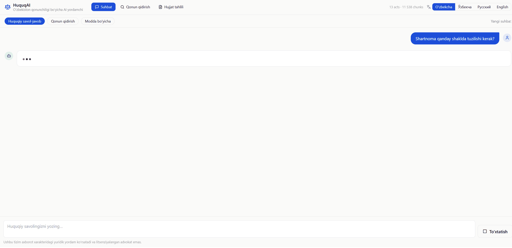
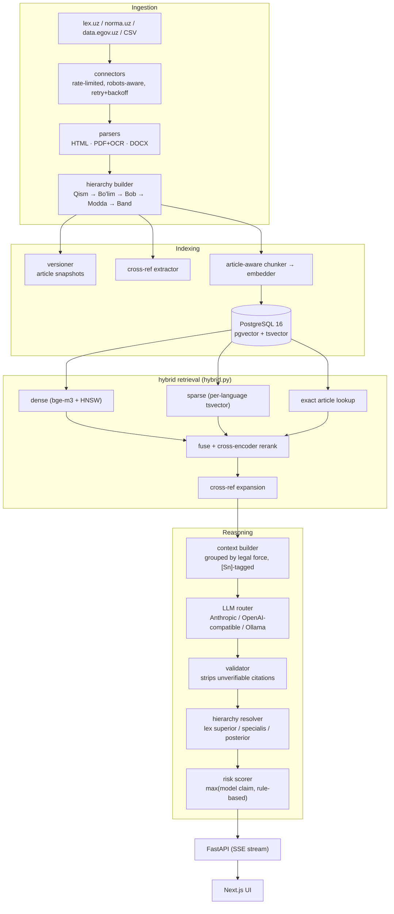

<div align="center">

# ⚖️ HuquqAI

**An AI legal research platform for the Republic of Uzbekistan — a hybrid-RAG system that answers legal questions in Uzbek (Latin & Cyrillic), Russian, and English, grounded in real statutory text with verifiable article-level citations.**

Every legal claim resolves to a real `[Sn]` source tag. Citations to articles that were never retrieved get stripped before they reach the user, not just flagged — see [How the anti-hallucination guarantee actually works](#-how-the-anti-hallucination-guarantee-actually-works).

[](https://www.python.org/)
[](https://fastapi.tiangolo.com/)
[](https://nextjs.org/)
[](https://github.com/pgvector/pgvector)
[](backend/tests/test_units.py)
[](LICENSE)

</div>

---

## ✨ What is this?

Ask a legal question the way you'd actually ask it — in any of four languages, in
either Uzbek script — and get back an answer grounded only in the actual text of
the Constitution and Codes, never a guess from the model's own training data.

> "Жиноят кодексининг 97-моддасида қандай жазо белгиланган?"
> "Какие основания для расторжения трудового договора по инициативе работодателя?"
> "14 yoshli o'smir o'g'irlik qilsa, javobgarlikka tortiladimi?"

...or upload a contract and get a clause-by-clause compliance screen against
mandatory Uzbek law, with concrete risks and redrafting suggestions — not a
generic "looks fine to me."

## 🎬 Demo

<div align="center">

</div>

*Real conversation against the actual running app — retrieval, LLM generation, and citation-tagged output, not a mockup.*

## 🏆 Key features

| | |
|---|---|
| 📌 **Citation-grounded Q&A** | Every legal statement carries an `[Sn]` tag resolving to a specific article. Uncited or unverifiable answers are rejected, not softened. |
| 🔍 **Hybrid retrieval** | Dense (`bge-m3` + pgvector HNSW) + sparse (per-language Postgres FTS) + exact-article lookup, fused and cross-encoder reranked. |
| ⚖️ **Legal hierarchy reasoning** | Constitution > Codes > Laws > Decrees, then *lex specialis*, then *lex posterior* — computed deterministically from adoption dates and act type, not left to the model to reason about on the fly. |
| 🔗 **Cross-reference expansion** | "…in the cases provided for by Article 333 of this Code" automatically pulls Article 333 into context. |
| 📄 **Document analysis** | Contracts segmented clause-by-clause, screened against mandatory Uzbek norms by both regex red-flags and an LLM compliance pass, with risk levels and concrete redrafting suggestions. |
| 🌐 **Trilingual + dual-script** | Uzbek Latin↔Cyrillic transliteration on both queries and index. Ask in Russian, retrieve from a Cyrillic-only source, answer in Russian — cross-language retrieval, not just translation. |
| 🚦 **Independent risk scoring** | The risk level shown is the *higher* of the model's own claim and a rule-based assessor (procedural deadlines, criminal exposure, conflicting provisions) — under-stating risk is the expensive failure mode here. |
| 🔀 **Provider-agnostic LLM layer** | Anthropic, any OpenAI-compatible endpoint (Groq, Gemini, vLLM, Together), or local Ollama — swappable via one env var, no code changes. |

## 🧱 Tech stack

- **Backend:** FastAPI, SQLAlchemy 2 (async), Alembic, Celery + Redis (ingestion, corpus stats, connector health checks)
- **Retrieval:** PostgreSQL 16 + pgvector (HNSW cosine), `BAAI/bge-m3` multilingual embeddings, Postgres full-text search, `BAAI/bge-reranker-v2-m3` cross-encoder
- **LLM layer:** a thin provider router — Anthropic, OpenAI-compatible (Groq / Gemini / vLLM / Together), or local Ollama, selectable globally or per-request
- **Frontend:** Next.js 15, React 19, TypeScript, Tailwind
- **Ingestion:** rate-limited, robots-aware connectors for lex.uz / norma.uz / data.egov.uz, with HTML/PDF+OCR/DOCX parsing and a hierarchy builder (Qism → Bo'lim → Bob → Modda → Band)

## 🔁 How it works — architecture



Full diagrams and design rationale: [`docs/ARCHITECTURE.md`](docs/ARCHITECTURE.md).

## ⚖️ How the anti-hallucination guarantee actually works

The hard part of a legal AI isn't generating fluent text — it's refusing to
invent law. Prompt instructions alone don't achieve that, so the guarantee is
enforced mechanically, not just requested:

1. Retrieved passages are tagged `[S1]…[Sn]`; the valid tag set is recorded
   *before* the model sees the question.
2. The model is instructed to cite those tags inline and to say plainly when
   the sources don't cover the question.
3. **The validator then checks the output against that recorded tag set.**
   Tags outside it are stripped from the answer. Article numbers asserted in
   prose but absent from retrieval are flagged as unverified — this is the
   exact mechanism that caught a real case during testing where the model
   named an article that was retrieved under a different act than it claimed
   in its own prose, and surfaced a visible warning instead of letting the
   mismatch through silently. A substantive answer with no citations at all
   is rejected outright and replaced with an honest "not found" message.
4. The risk scorer runs independently of the model's own risk claim and takes
   the **higher** of the two.
5. The streamed `done` event carries the *validated* text, and the client
   swaps it in — so a stripped citation never stays on screen, even for the
   tokens that streamed before validation ran.

## Setup

### Requirements

- Docker + Docker Compose
- An LLM API key — Anthropic, or any OpenAI-compatible provider (Groq, Gemini,
  etc.). A local-only path via Ollama also works with no API key at all.

### Install & run

```bash
cp .env.example .env
# set SECRET_KEY and at least one LLM provider key
docker compose up -d --build
```

Load a corpus — this repo's bundled CSV path is instant and deterministic:

```bash
docker compose exec backend python -m scripts.bootstrap \
  --admin admin@yourfirm.uz \
  --seed-csv-dir /app/data/seed
```

Open **http://localhost:3000**. API docs at **http://localhost:8000/docs**.

Full instructions, including crawling lex.uz directly: [`docs/DEPLOYMENT.md`](docs/DEPLOYMENT.md).

> **Iterating on the code?** `docker-compose.yml` bind-mounts `backend/app`
> into the backend, worker, and beat containers — a plain `docker compose
> restart backend` picks up code changes. `.env` changes need a recreate:
> `docker compose up -d backend`.

## API surface

| Endpoint | Purpose |
|---|---|
| `POST /api/v1/chat/stream` | SSE legal Q&A — `meta` → `sources` → `delta`* → `done` |
| `POST /api/v1/chat` | Non-streaming equivalent |
| `POST /api/v1/search` | Raw hybrid retrieval, no LLM — inspect what RAG actually finds |
| `POST /api/v1/search/article` | "Ask by article" — fetch and explain a named article |
| `POST /api/v1/documents/analyze` | Upload and analyse a contract |
| `GET /api/v1/laws` · `/{id}/tree` | Browse acts and their structural trees |
| `GET /api/v1/laws/{id}/articles/{n}/timeline` | Version history and diffs |
| `GET /api/v1/alerts` | New / amended acts |
| `POST /api/v1/admin/ingest` | Trigger ingestion (admin) |
| `GET /api/v1/admin/connectors/health` | Connector reachability + selector validation |
| `GET /health` | Liveness, corpus size, provider status |

## Tests

```bash
cd backend && pytest tests/ -v
```

79 unit tests, no database or network required — verified passing. They cover
the places where a silent regression is most damaging: transliteration (halves
Uzbek recall if wrong), hierarchy parsing (wrong citations), citation
validation (hallucinations reaching users), and the hierarchy-of-force rules
(wrong legal conclusions).

## What's been verified against the real running app

Beyond the unit suite, the full stack was exercised end-to-end against the
live app — not just mocked — across ten scenarios chosen to stress specific
failure modes: exact-article pinning in Cyrillic, cross-language retrieval
(a Russian question answered from a Cyrillic-only source), honest refusal
versus fabrication when a requested topic isn't in the corpus, a deliberately
fabricated article number, hierarchy-of-force conflict resolution, cross-
reference expansion, risk escalation on procedural deadlines, multi-code
synthesis, and criminal liability involving a minor — plus a full contract
upload through the actual browser UI, with the automated red-flag screen and
the LLM compliance pass both verified against the rendered output.

## Known limitations

Being direct about these rather than glossing over them:

- **Corpus coverage is partial.** The bundled seed loads the Constitution,
  both parts of the Civil Code, Civil Procedure, Criminal, Criminal
  Procedure, Administrative Liability, Labour, Tax, Family, and Budget Codes
  — 13 acts, 11,500+ chunks across Uzbek Latin, Uzbek Cyrillic, and Russian.
  Land, Customs, Housing, and Urban Planning legislation are not loaded; a
  question on those topics correctly says the retrieved sources don't cover
  it rather than guessing, but there's no real answer behind that honesty
  yet — load more acts via the ingestion connectors to close the gap.
- **CPU-only embedding and reranking is slow.** With no GPU, a query that
  retrieves against the full corpus (rather than a narrower, act-type-
  filtered one) can take 1–3 minutes end to end. `EMBEDDING_DEVICE=cuda` is
  supported and meaningfully changes this if a GPU is available.
- **Free-tier LLM providers have real, sometimes surprising limits.** Groq's
  free "on_demand" tier shares one daily token quota per *organization*, not
  per key — issuing a new key under the same account doesn't get you a fresh
  quota. Gemini's model aliases (e.g. `gemini-flash-latest`) can silently
  resolve to a brand-new model with a much stricter free-tier cap than an
  established one. Worth knowing before assuming a "new key" fixes a
  rate-limit wall.
- **A generic legal keyword can be a footgun for act-type inference.**
  Retrieval infers an act-type filter from words like a named Code
  ("Civil Code", "Fuqarolik kodeksi") to narrow the search. Earlier in
  development this list also included the bare word "law"/"qonun"/"закон" —
  which is such a common word in ordinary legal phrasing that it produced
  false-positive filtering to a specific act category, silently returning
  zero results on any query that happened to contain it. That specific hint
  has been removed; the remaining ones are all precise multi-word or
  Code-specific patterns, deliberately chosen not to fire on ordinary usage.
- **Not production-hardened.** Secrets live in a plaintext `.env` (correctly
  gitignored, but not vaulted), there's no rate-limit-aware secrets rotation,
  and this hasn't been through a security review. See the ingestion caveats
  below before pointing this at a production dataset.

### Before you run this against production data

- **lex.uz has no documented public API.** The connector prefers a JSON
  endpoint if you have an access agreement with the Ministry of Justice, and
  otherwise falls back to polite HTML scraping. Confirm the terms of use,
  and seek written permission for sustained crawling.
- **The HTML selectors will eventually break.** They're isolated at the top
  of `connectors/lexuz.py`, and a daily `connector_selfcheck_task` alerts you
  when they stop matching — a silent break otherwise degrades to an empty
  corpus, which surfaces as "no sources found" rather than an error.
- **norma.uz is a commercial publisher.** Confirm your licence covers
  derivative indexing. Its content is typed `COMMENTARY` and never presented
  as binding law.
- **Court decisions are not a source of law** in Uzbekistan's civil-law
  system. They're indexed for interpretation only and rendered with a
  non-binding marker.

## License

[MIT](LICENSE) for this codebase. The legal texts themselves are official
publications of the Republic of Uzbekistan and carry their own terms; this
repository does not redistribute them beyond what's needed to run the demo
corpus.
