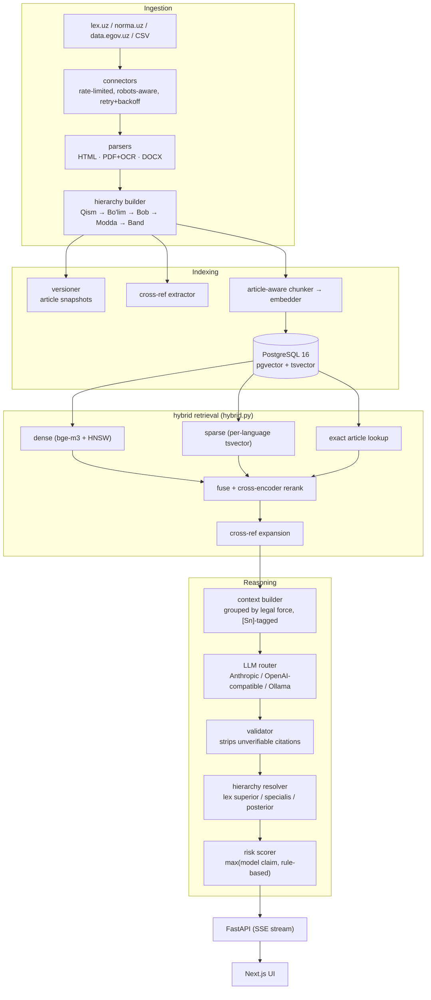

<div align="center">

# ⚖️ QonunAI

**An AI legal research platform for the Republic of Uzbekistan — a hybrid-RAG system that answers legal questions in Uzbek (Latin & Cyrillic), Russian, and English, grounded in real statutory text with verifiable article-level citations.**

Every legal claim resolves to a real `[Sn]` source tag. Citations to articles that were never retrieved get stripped before they reach the user, not just flagged — see [How the anti-hallucination guarantee actually works](#-how-the-anti-hallucination-guarantee-actually-works).

**[→ Try the live app](https://ai-frontend-ten-roan.vercel.app)**  ·  [API](https://uzlex-ai.fly.dev/docs)  ·  [Health & corpus status](https://uzlex-ai.fly.dev/health)

[](https://www.python.org/)
[](https://fastapi.tiangolo.com/)
[](https://nextjs.org/)
[](https://github.com/pgvector/pgvector)
[](backend/tests/)
[](backend/benchmarks/)
[](backend/benchmarks/)
[](LICENSE)

</div>

---

## ✨ What is this?

Ask a legal question the way you'd actually ask it — in any of four languages, in
either Uzbek script — and get back an answer grounded only in the actual text of
the Constitution and Codes, never a guess from the model's own training data.

> "Жиноят кодексининг 97-моддасида қандай жазо белгиланган?"
> "Какие основания для расторжения трудового договора по инициативе работодателя?"
> "14 yoshli o'smir o'g'irlik qilsa, javobgarlikka tortiladimi?"

...or upload a contract and get a clause-by-clause compliance screen against
mandatory Uzbek law, with concrete risks and redrafting suggestions — not a
generic "looks fine to me."

## 🎬 Demo

<div align="center">

</div>

*Real conversation against the actual running app — retrieval, LLM generation, and citation-tagged output, not a mockup.*

## 🏆 Key features

| | |
|---|---|
| 📌 **Citation-grounded Q&A** | Every legal statement carries an `[Sn]` tag resolving to a specific article. Uncited or unverifiable answers are rejected, not softened. |
| 🔗 **Article-level deep links** | Citations open the *provision*, not the top of a 4 MB document — `lex.uz/docs/6257288#6259020` lands directly on 80-modda. See [Deep linking into lex.uz](#-deep-linking-into-lexuz). |
| 🔍 **Hybrid retrieval** | Dense (`bge-m3` + pgvector HNSW) + sparse (per-language Postgres FTS) + article-title + exact-article lookup, fused by RRF. Cross-encoder reranking is implemented but off in the live deployment — see [Deployment status](#-deployment-status). |
| ⚖️ **Legal hierarchy reasoning** | Constitution > Codes > Laws > Decrees, then *lex specialis*, then *lex posterior* — computed deterministically from adoption dates and act type, not left to the model to reason about on the fly. |
| 🔗 **Cross-reference expansion** | "…in the cases provided for by Article 333 of this Code" automatically pulls Article 333 into context. |
| 📄 **Document analysis** | Contracts segmented clause-by-clause, screened against mandatory Uzbek norms by both regex red-flags and an LLM compliance pass, with risk levels and concrete redrafting suggestions. |
| 🌐 **Trilingual + dual-script** | Uzbek Latin↔Cyrillic transliteration on both queries and index. Ask in Russian, retrieve from a Cyrillic-only source, answer in Russian — cross-language retrieval, not just translation. |
| 🚦 **Independent risk scoring** | The risk level shown is the *higher* of the model's own claim and a rule-based assessor (procedural deadlines, criminal exposure, conflicting provisions) — under-stating risk is the expensive failure mode here. |
| 🔀 **Provider-agnostic LLM layer** | Anthropic, any OpenAI-compatible endpoint (Groq, Gemini, vLLM, Together), or local Ollama — swappable via one env var, no code changes. |

## 🧱 Tech stack

- **Backend:** FastAPI, SQLAlchemy 2 (async), Alembic, Celery + Redis (ingestion, corpus stats, connector health checks)
- **Retrieval:** PostgreSQL 16 + pgvector (HNSW cosine), `BAAI/bge-m3` multilingual embeddings, Postgres full-text search, `BAAI/bge-reranker-v2-m3` cross-encoder
- **LLM layer:** a thin provider router — Anthropic, OpenAI-compatible (Groq / Gemini / vLLM / Together), or local Ollama, selectable globally or per-request
- **Frontend:** Next.js 16 (App Router), React 19, TypeScript (strict), Tailwind — token-streamed SSE chat with markdown rendering and deep-linked citation cards
- **Ingestion:** rate-limited, robots-aware connectors for lex.uz / norma.uz / data.egov.uz, with HTML/PDF+OCR/DOCX parsing and a hierarchy builder (Qism → Bo'lim → Bob → Modda → Band)

## 🔁 How it works — architecture



Full diagrams and design rationale: [`docs/ARCHITECTURE.md`](docs/ARCHITECTURE.md).

## ⚖️ How the anti-hallucination guarantee actually works

The hard part of a legal AI isn't generating fluent text — it's refusing to
invent law. Prompt instructions alone don't achieve that, so the guarantee is
enforced mechanically, not just requested:

1. Retrieved passages are tagged `[S1]…[Sn]`; the valid tag set is recorded
   *before* the model sees the question.
2. The model is instructed to cite those tags inline and to say plainly when
   the sources don't cover the question.
3. **The validator then checks the output against that recorded tag set.**
   Tags outside it are stripped from the answer. Article numbers asserted in
   prose but absent from retrieval are flagged as unverified. A tag attributed
   in prose to the wrong act (real tag, real article, just the wrong law
   named next to it — the subtlest of the three failure modes, since both the
   tag and the article number check out individually) gets an inline
   correction appended right where the false claim was made, not just a
   warning at the end the reader has to cross-reference. A substantive answer
   with no citations at all is rejected outright and replaced with an honest
   "not found" message.
4. The risk scorer runs independently of the model's own risk claim (if it
   makes one — the prompt asks it not to, since the risk badge already
   renders this from the same structured assessment) and takes the
   **higher** of the two. If the model states a level anyway, it's
   reconciled to match rather than left to silently contradict the badge.
5. The streamed `done` event carries the *validated* text, and the client
   swaps it in — so a stripped citation never stays on screen, even for the
   tokens that streamed before validation ran.

## 🔗 Deep linking into lex.uz

A citation that opens a four-megabyte document and leaves you to scroll isn't a
citation. QonunAI links straight to the article — and getting there required
working out how lex.uz actually addresses provisions, because it isn't documented.

There is no `#article80` anchor. Every structural node has a stable numeric id,
surfaced in the table of contents as `scrollText('6259020')`. That handler does
`history.pushState(null, '', '#' + hash)`, a matching element carries
`id`/`name` with that value, and `window.onload` re-reads the hash — so a
pasted link scrolls correctly on a cold load. The canonical form is therefore:

```
https://lex.uz/docs/6257288#6259020   → 80-modda
```

Two things make naive extraction wrong, both found by measuring rather than assuming:

- **Sub-numbered articles.** lex.uz renders article 57¹ as the literal text
  `Статья 57 1 .` — space-separated digits, not a superscript entity. Parsing
  only the leading number collapses 57, 57¹ and 57² into one key. They are
  legally distinct provisions, so they're normalised to `57`, `57-1`, `57-2`.
- **The corpus had already collapsed them.** `chunks.article_number` holds no
  separators, so all three were stored as `"57"`. Matching an anchor on article
  number alone would mis-link two of every three. Disambiguation runs on the
  heading, and returns nothing rather than guessing — a document-level link is
  acceptable; a link to the wrong article is not.

Measured: **581/581** articles resolved on the Labour Code (uz-Cyrl) and
**404/404** on the Criminal Code (ru). Backfilled across all 13 indexed acts,
**84.2%** of chunks (9,710/11,538) carry an anchor; the rest are chunks with no
article number, or genuinely ambiguous ones, and degrade to document links.

```bash
# Honours lex.uz's published Crawl-delay of 20s — do not parallelise.
docker compose exec backend python -m app.workers.backfill_anchors --dry-run
```

## Setup

### Requirements

- Docker + Docker Compose
- An LLM API key — Anthropic, or any OpenAI-compatible provider (Groq, Gemini,
  etc.). A local-only path via Ollama also works with no API key at all.

### Install & run

```bash
cp .env.example .env
# set SECRET_KEY and at least one LLM provider key
docker compose up -d --build
```

Load a corpus — this repo's bundled CSV path is instant and deterministic:

```bash
docker compose exec backend python -m scripts.bootstrap \
  --admin admin@yourfirm.uz \
  --seed-csv-dir /app/data/seed
```

Open **http://localhost:3000**. API docs at **http://localhost:8000/docs**.

Full instructions, including crawling lex.uz directly: [`docs/DEPLOYMENT.md`](docs/DEPLOYMENT.md).

> **Iterating on the code?** `docker-compose.yml` bind-mounts `backend/app`
> into the backend, worker, and beat containers — a plain `docker compose
> restart backend` picks up code changes. `.env` changes need a recreate:
> `docker compose up -d backend`.

## 🚀 Production deployment

The live instance runs split across two providers:

| Component | Host | Notes |
|---|---|---|
| Frontend | Vercel | Next.js 16, streams SSE from the API |
| API | Fly.io (`fra`) | FastAPI, `shared-cpu-4x` / 2 GB |
| Postgres + pgvector | Fly.io | 3 GB volume, private networking only |
| Redis | Fly.io | Rate limits and cache, private networking only |

Neither datastore is publicly reachable — the API talks to them over Fly's
private network, and the schema is migrated through a temporary
`flyctl proxy` tunnel rather than an exposed port.

```bash
cd backend && flyctl deploy --now
```

**Measured end-to-end on the live instance** (Labour Code question,
uz-Latn): retrieval **346 ms**, LLM generation **11,090 ms**, total
**12.7 s**. Generation is 87% of wall-clock — retrieval is not the
bottleneck, so optimisation effort belongs in prompt caching, context size,
and time-to-first-token rather than in the retriever.

> Machines are configured to scale to zero (`min_machines_running = 0`), so
> the first request after an idle period pays a cold start that includes
> loading the embedding model. Set it to `1` before a demo.

## API surface

| Endpoint | Purpose |
|---|---|
| `POST /api/v1/chat/stream` | SSE legal Q&A — `meta` → `sources` → `delta`* → `done` |
| `POST /api/v1/chat` | Non-streaming equivalent |
| `POST /api/v1/search` | Raw hybrid retrieval, no LLM — inspect what RAG actually finds |
| `POST /api/v1/search/article` | "Ask by article" — fetch and explain a named article |
| `POST /api/v1/documents/analyze` | Upload and analyse a contract |
| `GET /api/v1/laws` · `/{id}/tree` | Browse acts and their structural trees |
| `GET /api/v1/laws/{id}/articles/{n}/timeline` | Version history and diffs |
| `GET /api/v1/alerts` | New / amended acts |
| `POST /api/v1/admin/ingest` | Trigger ingestion (admin) |
| `GET /api/v1/admin/connectors/health` | Connector reachability + selector validation |
| `GET /health` | Liveness, corpus size, provider status |

## Tests

```bash
cd backend && pytest tests/ -v
```

225 unit tests, no database or network required — verified passing. They cover
the places where a silent regression is most damaging: transliteration (halves
Uzbek recall if wrong), hierarchy parsing (wrong citations), citation
validation (hallucinations reaching users), the hierarchy-of-force rules
(wrong legal conclusions), and anchor extraction (citations that open the
wrong article).

## 🚧 Deployment status

The live app runs dense retrieval, sparse full-text search, article-title
search and exact-article lookup, fused by RRF. **Cross-encoder reranking is
implemented but switched off** — see below.

For most of this project's life dense retrieval was silently dead.
`sentence-transformers` was never listed in `requirements.txt`, so every chunk
carried a real `bge-m3` vector (1024-dim, unit-norm, 11,042 distinct across
11,538 chunks) while the *query* side could not embed at all. The dense branch
raised on every request, the retriever fused three branches instead of four,
and the reranker never loaded. Nothing reported it: `/health` showed
`embedded_chunks: 11538` and a green status throughout, because that field
counts documents and cannot detect a broken query path.

Three further defects were hiding behind that one, each only visible once the
one in front of it was fixed:

1. **torch was pinned below 2.6.** `transformers` refuses `torch.load` on older
   versions (CVE-2025-32434) and bge-m3 ships `.bin` weights, so the model
   would have failed to load regardless of available memory.
2. **Baking the weights into the image made it undeployable.** A 4.8 GB image
   exceeds Fly's machine-update timeout; the API returns HTTP 408, `flyctl
   deploy` swallows it and reports success, and the machines keep running the
   previous image. Weights are now downloaded at runtime and the startup warmup
   runs in the background so the port binds immediately.
3. **The relevance threshold silently capped recall at three results.**
   `MIN_RELEVANCE_SCORE` is calibrated for the cross-encoder's sigmoid output,
   but the score falls back to the RRF fused value (~0.016–0.065), which can
   never clear a 0.25 threshold. With the reranker off, every candidate was
   discarded on every query and a three-result fallback took over.

### What dense retrieval bought

Cross-language retrieval, which the corpus makes essential:

| Script / language | Chunks | Share |
|---|---|---|
| Uzbek Cyrillic | 5,904 | 51% |
| Russian | 4,927 | 43% |
| Uzbek Latin | 707 | 6% |

Latin↔Cyrillic is bridged lexically by the transliteration layer. **Uzbek↔Russian
is bridged only by the shared embedding space** — nothing lexical connects
`odam oʻgʻirlash` to `похищение человека`.

Concretely, *"Odam oʻgʻirlash uchun qanday jazo belgilangan?"* previously
returned four results and never reached Criminal Code art. 137. It now returns
eleven and ranks art. 137 by embedding similarity (0.60). Benchmark-wide, MRR
went from 0.694 to 0.774 and Recall@1 from 0.600 to 0.700.

### Why reranking is still off

`bge-reranker-v2-m3` is a 568M-parameter cross-encoder that scores every
candidate passage against the query. It was enabled and measured on
`performance-4x` (4 **dedicated** cores, 8 GB):

| Candidates × tokens | Latency |
|---|---|
| 30 × 1024 | 71 s |
| 12 × 320 | > 200 s (timed out) |

The ranking it produces is good — it puts Criminal Code art. 137 first with a
score of 0.73 — but not at any latency a user will wait for. Cutting the work
by ~25x did not produce a proportional speedup, which points at the per-forward
cost on CPU rather than the amount of work queued.

A cross-encoder this size needs a GPU, or a materially smaller reranker such as
`bge-reranker-base` (278M). It is off, the machines are back on `shared-cpu-4x`
since the dedicated cores bought nothing without it, and `RERANK_CANDIDATE_CAP`
and `RERANK_MAX_LENGTH` are now settings so the next attempt needs no code
change. The relevance threshold correctly does not apply while it is off.

### Current production configuration

| Setting | Value | Why |
|---|---|---|
| VM | `shared-cpu-4x`, 8 GB | dense retrieval embeds one short query per request; bge-m3 is ~2.3 GB resident |
| `DENSE_RETRIEVAL_ENABLED` | `true` | |
| `RERANKER_ENABLED` | `false` | too slow even on dedicated CPU (above) |
| `PREFETCH_MODELS` | `false` | baking weights in makes the image undeployable |
| `UVICORN_WORKERS` | `1` | each worker would load its own copy of the model |

`RERANKER_ENABLED` and the rate limits are **Fly secrets**, and secrets silently
shadow `fly.toml [env]`. Check `flyctl secrets list` before trusting any value
in the committed config.

## 📊 Retrieval benchmark

Quality claims are measured, not asserted. `uzlegal-v1`
([`backend/benchmarks/`](backend/benchmarks/)) holds 30 in-scope questions whose
gold article labels were read directly from `chunks.heading` in the production
corpus and hand-verified, plus out-of-scope and adversarial items. A hit
requires **both** the article number and the act to match, so a coincidental
article 106 in the wrong code does not count.

```bash
python backend/benchmarks/run_benchmark.py --base https://uzlex-ai.fly.dev --answers 0
```

Retrieval runs through `/api/v1/search`, which exercises the full hybrid
pipeline with no LLM call — so the expensive metric is free to measure.

| Metric | First run | Sparse only | With dense | Target |
|---|---|---|---|---|
| Recall@1 | 0.200 | 0.600 | **0.700** | — |
| Recall@5 | 0.433 | 0.833 | **0.833** | 0.90 |
| Recall@10 | — | — | **0.900** | 0.95 |
| MRR | 0.294 | 0.694 | **0.774** | 0.75 ✅ |
| Median retrieval | 431 ms | 695 ms | 1556 ms | < 2000 ms |

Dense retrieval bought ranking quality rather than raw coverage: Recall@5 is
unchanged, but the governing article is now first for 70% of questions instead
of 60%, and MRR clears its target. It also restored cross-language retrieval —
see [Deployment status](#-deployment-status).

Three defects closed that gap, each found by measurement rather than reading code:

1. **Prefix matching ran the wrong direction.** Uzbek has no Postgres stemmer, so
   the sparse path emits `token:*` — but the prefix applies to the *query* token.
   Someone typing `шаклда` could never reach an article titled `шакли`.
2. **Article titles were searchable but drowned.** In nearly every failure the
   answer sat in the title while hundreds of articles merely *mentioning* the
   phrase outranked it. A heading-only branch with length-normalised ranking now
   fuses in at 2× weight.
3. **Sub-numbered articles were collapsed.** 57, 57¹ and 57² all stored as
   `"57"` — legally distinct provisions sharing one identifier. 702 articles
   were renumbered from the lex.uz table of contents.

> **Note the rate limit.** A full run needs `RATE_LIMIT_ANON_PER_HOUR` above 20,
> or requests start returning 429 around item 20 and score as misses.

## What's been verified against the real running app

Beyond the unit suite, the full stack was exercised end-to-end against the
live app — not just mocked — across ten scenarios chosen to stress specific
failure modes: exact-article pinning in Cyrillic, cross-language retrieval
(a Russian question answered from a Cyrillic-only source), honest refusal
versus fabrication when a requested topic isn't in the corpus, a deliberately
fabricated article number, hierarchy-of-force conflict resolution, cross-
reference expansion, risk escalation on procedural deadlines, multi-code
synthesis, and criminal liability involving a minor — plus a full contract
upload through the actual browser UI, with the automated red-flag screen and
the LLM compliance pass both verified against the rendered output.

## Known limitations

Being direct about these rather than glossing over them:

- **Corpus coverage is partial.** The bundled seed loads the Constitution,
  both parts of the Civil Code, Civil Procedure, Criminal, Criminal
  Procedure, Administrative Liability, Labour, Tax, Family, and Budget Codes
  — 13 acts, 11,500+ chunks across Uzbek Latin, Uzbek Cyrillic, and Russian.
  Land, Customs, Housing, and Urban Planning legislation are not loaded; a
  question on those topics correctly says the retrieved sources don't cover
  it rather than guessing, but there's no real answer behind that honesty
  yet — load more acts via the ingestion connectors to close the gap.
- **Answer latency is dominated by the LLM, not retrieval.** On the live
  Fly.io instance retrieval takes **346 ms** while generation takes **11.1 s**
  — 87% of the 12.7 s round trip. Local CPU-only runs can be far slower still
  (1–3 minutes against the full unfiltered corpus). `EMBEDDING_DEVICE=cuda` fixes
  this if a GPU is available — verified on an RTX 4050 (6 GB): retrieval
  dropped from 56–100s to **~11s**, roughly a 5–9x speedup, with the
  embedder and reranker actually saturating the GPU at ~100% utilization
  during a query. See the GPU section in
  [`.env.example`](.env.example) for what else that needs (a CUDA torch
  build via `TORCH_INDEX_URL`, the backend's GPU device reservation in
  `docker-compose.yml`, and `UVICORN_WORKERS=1` so two worker processes
  don't each load their own copy of both models onto the same card).
- **Free-tier LLM providers have real, sometimes surprising limits.** Groq's
  free "on_demand" tier shares one daily token quota per *organization*, not
  per key — issuing a new key under the same account doesn't get you a fresh
  quota. Gemini's model aliases (e.g. `gemini-flash-latest`) can silently
  resolve to a brand-new model with a much stricter free-tier cap than an
  established one. Worth knowing before assuming a "new key" fixes a
  rate-limit wall.
- **A generic legal keyword can be a footgun for act-type inference.**
  Retrieval infers an act-type filter from words like a named Code
  ("Civil Code", "Fuqarolik kodeksi") to narrow the search. Earlier in
  development this list also included the bare word "law"/"qonun"/"закон" —
  which is such a common word in ordinary legal phrasing that it produced
  false-positive filtering to a specific act category, silently returning
  zero results on any query that happened to contain it. That specific hint
  has been removed; the remaining ones are all precise multi-word or
  Code-specific patterns, deliberately chosen not to fire on ordinary usage.
- **Sub-numbered articles are collapsed at ingestion.** `chunks.article_number`
  stores no separators, so articles 57, 57¹ and 57² all land as `"57"` —
  legally distinct provisions sharing one identifier, distinguishable only by
  heading. Deep linking works around this by disambiguating on the heading, but
  the underlying citation ambiguity is real and predates that work. Fixing the
  parser would raise anchor coverage above 84.2% and remove the ambiguity at
  source.
- **Full-corpus crawling is bounded by politeness, not engineering.**
  `lex.uz/robots.txt` publishes `Crawl-delay: 20`, capping one compliant
  crawler at ~4,320 documents/day. Codes and laws are a day or two; everything
  including historical revisions is measured in months. Parallelising to beat
  this would violate robots.txt — the legitimate route to national-scale
  coverage is a bulk-data agreement with the Ministry of Justice, not a faster
  scraper.
- **Retrieval quality is measured, and not yet at target.** `uzlegal-v1`
  (`backend/benchmarks/`) scores **Recall@5 = 0.833** against a 0.90 target and
  **MRR = 0.694** against 0.75, on 30 questions whose gold labels were read from
  the corpus and hand-verified. That is up from 0.433 at first measurement, but
  roughly one question in six still misses the governing article. The remaining
  failures share a shape: the article's title *paraphrases* the question rather
  than sharing its words, so neither the heading branch nor lexical search
  fires.
- **Not production-hardened.** Secrets live in a plaintext `.env` (correctly
  gitignored, but not vaulted), there's no rate-limit-aware secrets rotation,
  and this hasn't been through a security review. See the ingestion caveats
  below before pointing this at a production dataset.

### Before you run this against production data

- **lex.uz has no documented public API.** The connector prefers a JSON
  endpoint if you have an access agreement with the Ministry of Justice, and
  otherwise falls back to polite HTML scraping. Confirm the terms of use,
  and seek written permission for sustained crawling.
- **The HTML selectors will eventually break.** They're isolated at the top
  of `connectors/lexuz.py`, and a daily `connector_selfcheck_task` alerts you
  when they stop matching — a silent break otherwise degrades to an empty
  corpus, which surfaces as "no sources found" rather than an error.
- **norma.uz is a commercial publisher.** Confirm your licence covers
  derivative indexing. Its content is typed `COMMENTARY` and never presented
  as binding law.
- **Court decisions are not a source of law** in Uzbekistan's civil-law
  system. They're indexed for interpretation only and rendered with a
  non-binding marker.

## License

[MIT](LICENSE) for this codebase. The legal texts themselves are official
publications of the Republic of Uzbekistan and carry their own terms; this
repository does not redistribute them beyond what's needed to run the demo
corpus.
