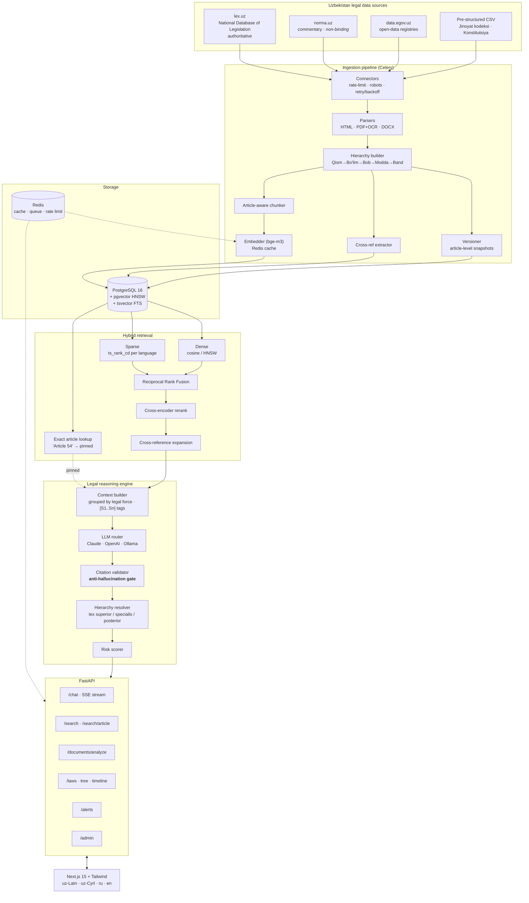
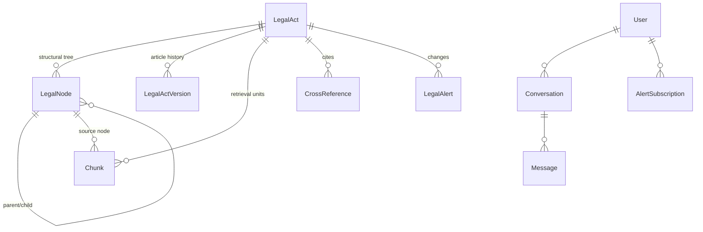

# HuquqAI — Architecture

## 1. System overview



## 2. Request lifecycle — a legal question

```mermaid
sequenceDiagram
    participant U as User
    participant API as FastAPI
    participant R as Hybrid retriever
    participant DB as Postgres
    participant L as LLM
    participant V as Validator

    U->>API: POST /chat/stream "Shartnoma qanday tuziladi?"
    API->>API: detect language → uz-Latn
    API->>R: retrieve(query, lang)
    R->>R: extract article numbers + act hints
    par three retrieval branches
        R->>DB: dense (HNSW cosine)
        and
        R->>DB: sparse (tsvector, both scripts)
        and
        R->>DB: exact article fetch
    end
    R->>R: RRF fuse → rerank → dedupe by article
    R->>DB: expand cross-references
    R-->>API: 12 chunks, ordered by relevance then legal force
    API-->>U: event: sources  (citation chips render immediately)
    API->>L: system (cached) + context [S1..Sn] + question
    loop streaming
        L-->>API: token
        API-->>U: event: delta
    end
    API->>V: validate(answer, sources)
    V->>V: strip fabricated [Sn]; flag unretrieved article numbers
    API->>API: hierarchy resolve + risk score
    API-->>U: event: done (validated answer, citations, risk, conflicts)
    API->>DB: persist message + QueryLog
```

## 3. Anti-hallucination design

The central claim — *"only answer with retrieved sources"* — is enforced by a
closed loop, not by prompt wording alone.

| Stage | Mechanism | Failure it prevents |
|---|---|---|
| Context build | Every passage gets a `[Sn]` tag; the set of valid tags is recorded | Model cannot cite what was not supplied |
| Prompt | Explicit instruction to cite tags inline; "say so" if sources insufficient | Confident answers on missing law |
| Validation | Tags not in the valid set are **stripped**; the answer is rewritten | Fabricated source references reaching users |
| Validation | Article numbers asserted in prose but absent from retrieval are **flagged** | Invented statutes ("Article 999 of the Civil Code") |
| Validation | Substantive answer with **zero** citations is **rejected** | Ungrounded legal advice |
| Risk | Weak retrieval / single source / no sources force risk upward | Low-confidence answers presented as settled |
| Streaming | `done` event carries the *validated* text, which the client swaps in | Stripped citations remaining visible |

## 4. Hierarchy of normative acts

Encoded in `ActType.precedence` and applied by `services/reasoning/hierarchy.py`:

| Force | Act type | Uzbek |
|---:|---|---|
| 100 | Constitution | Konstitutsiya |
| 90 | Constitutional law | Konstitutsiyaviy qonun |
| 80 | Code | Kodeks |
| 70 | Law | Qonun |
| 60 | Presidential decree | Farmon |
| 55 | Presidential resolution | Qaror |
| 50 | Cabinet of Ministers resolution | VM qarori |
| 40 | Ministerial / agency act | Buyruq, Nizom |
| 30 | Local act | Mahalliy hujjat |
| 20 | Court decision — *persuasive only* | Sud qarori |
| 10 | Commentary — *doctrinal only* | Sharh |

Uzbekistan is a civil-law jurisdiction: **court decisions are not a source of
law**. They are ingested and retrievable for interpretation, tagged
non-binding, and rendered with a visual marker in the UI. Applied after force:
*lex specialis derogat legi generali*, then *lex posterior derogat legi priori*
using the ingested adoption/amendment dates.

## 5. Why these retrieval choices

**bge-m3 embeddings.** Uzbek is poorly covered by English-first embedding
models, and the corpus is genuinely trilingual. bge-m3 puts uz/ru/en in one
vector space, so a Russian query retrieves the Uzbek original.

**Reciprocal Rank Fusion, not weighted scores.** Cosine similarity and
`ts_rank_cd` are on incomparable scales, and `ts_rank_cd` shifts with document
length and term count. RRF consumes only ranks, so there is no per-corpus weight
to tune and re-tune.

**Postgres FTS rather than in-memory BM25.** `rank_bm25` needs the whole corpus
resident — untenable for a national legal corpus, and it cannot filter by act
status in the same query. Postgres `ts_rank_cd` is index-backed, incremental,
and multilingual. (BM25 remains available for the offline FAISS profile.)

**Exact article pinning.** Legal queries frequently name their target. Dense
retrieval is unreliable at pinpointing an exact article number, so named
articles are fetched directly and pinned ahead of the ranked results — before
*and* after reranking, since reranking can otherwise bury them.

**Article-aware chunking.** Fixed-window chunking splits an article mid-sentence,
so a chunk can state a rule without its exception and the citation metadata
becomes ambiguous. One article = one chunk wherever it fits; long articles split
on clause boundaries with the heading repeated on every part.

**Cross-reference expansion.** Uzbek statutes lean on internal references
("in the cases provided for by Article 333 of this Code"). Answering from the
retrieved article alone yields confidently incomplete advice, so referenced
articles are pulled into context and labelled as supporting.

**Both Uzbek scripts, always.** LexUZ publishes Latin and Cyrillic; users type
either. Every query is expanded to both scripts for keyword search. Without
this, roughly half of Uzbek keyword recall disappears silently.

## 6. Folder structure

```
uzlex-ai/
├── docker-compose.yml
├── .env.example
├── backend/
│   ├── Dockerfile
│   ├── requirements.txt
│   ├── alembic/versions/0001_initial.py
│   ├── scripts/bootstrap.py           # corpus + admin bootstrap CLI
│   ├── tests/test_units.py
│   └── app/
│       ├── main.py                    # FastAPI app, middleware, /health
│       ├── core/                      # config · logging · security · deps
│       ├── db/                        # models (corpus schema) · session
│       ├── schemas/                   # pydantic contracts
│       ├── api/v1/routers/            # auth chat search laws documents alerts admin
│       ├── workers/                   # celery app · tasks · beat schedule
│       └── services/
│           ├── ingestion/
│           │   ├── connectors/        # lexuz · norma · gov_opendata
│           │   ├── parsers/           # html · pdf(+OCR) · docx
│           │   ├── hierarchy_builder.py
│           │   ├── chunker.py
│           │   ├── pipeline.py
│           │   └── seed_csv.py
│           ├── rag/                   # embedder vector_store keyword hybrid
│           │                          # reranker crossref context_builder
│           ├── reasoning/             # prompts hierarchy risk validator engine
│           ├── llm/                   # base anthropic openai ollama router
│           ├── lang/                  # detect · translit (Latin↔Cyrillic)
│           ├── documents/analyzer.py
│           └── alerts/service.py
├── frontend/
│   ├── app/                           # layout · page · chat · search · documents
│   ├── components/                    # AppShell ChatPanel MessageBubble
│   │                                  # CitationCard RiskBadge HierarchyPanel
│   │                                  # LawSearch DocumentUpload LanguageSwitcher
│   └── lib/                           # api (SSE client) · i18n · types · utils
├── infra/                             # init-db.sql · nginx.conf
└── docs/                              # ARCHITECTURE · DEPLOYMENT · INGESTION
```

## 7. Data model



Every `Chunk` carries the full citation contract required by the spec:
`law_name`, `article_number`, `jurisdiction`, `language`, `date_of_adoption`,
`last_updated` — plus `act_type` (for hierarchy) and `hierarchy_path` (for
provenance).

## 8. Scaling notes

| Concern | Approach |
|---|---|
| Corpus growth | HNSW scales sub-linearly; partition `chunks` by `act_type` past ~5M rows |
| Bulk import | Drop the HNSW index, load, rebuild — ~10× faster than incremental |
| Embedding cost | Redis cache keyed by SHA-256 of normalised text, 30-day TTL |
| LLM cost | System prompt is frozen per (mode, language) so prompt caching hits |
| Concurrency | Stateless API — scale horizontally; workers hold the model in RAM (~2.5 GB each) |
| Long answers | SSE end to end; nginx buffering disabled for `/api/` |
